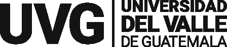

<p align="left">
  
</p>

# Secure CRM — Laboratorio OWASP (DAST)

CRM de tickets **intencionalmente vulnerable** para el curso **Desarrollo de Software
Seguro** de la **Universidad del Valle de Guatemala**. Cada hallazgo se mapea al
**OWASP Top 10:2025** y al **CWE Top 25:2025**, y se estima su riesgo con **CVSS v3.1**.

> **Este proyecto contiene fallos de seguridad a propósito.** Úsalo **solo** en tu
> entorno local o de staging autorizado. **Nunca** lo despliegues en producción ni
> apuntes herramientas de escaneo a sistemas de terceros sin autorización escrita.

---

## Instrucciones generales

1. **Levantar el laboratorio**

   Elige una de las dos opciones. Abre **http://localhost:3000** cuando termine.

   **Opción A — Node + pnpm** (desarrollo local):

   ```bash
   pnpm install      # instala todo el monorepo
   pnpm seed         # crea y puebla la base de datos SQLite
   pnpm dev          # levanta API (:4000) y Web (:3000) a la vez
   ```

   **Opción B — Docker** (simula un servidor real):

   ```bash
   docker compose up --build
   ```

   - Web → **http://localhost:3000**
   - API → **http://localhost:4000**

2. **Explorar la aplicación**

   Inicia sesión, recorre el panel, los tickets y (si eres admin) la gestión de
   usuarios. Familiarízate con el flujo antes de usar las herramientas.

3. **Secuencia del laboratorio**

   **Importante:** las dos partes son secuenciales. Lo que documentes en la Parte 1
   es la base de las correcciones de la Parte 2.

   1. **Parte 1 — Detección:** descubre y clasifica los hallazgos (ZAP, Burp, CVSS).
   2. **Parte 2 — Mitigación:** implementa correcciones en **tu propia rama** y
      reevalúa.

La rama `main` se mantiene **vulnerable a propósito**. El flujo esperado es:

1. Haz un fork / clona este repositorio.
2. Crea tu rama: `git checkout -b correcciones-<tu-equipo>`.
3. Completa la Parte 1 con la [guía del laboratorio](docs/guia-laboratorio.html).
4. Implementa las correcciones en el código de tu rama (mínimo 2, según la rúbrica).
5. Reevalúa con ZAP/Burp y recalcula el CVSS.
6. Abre un **Pull Request** contra este repo para que el instructor revise tus cambios.

> No “corrijas” apagando funciones ni con flags: la rúbrica pide **código** que
> mitigue el fallo (consultas parametrizadas, sanitización, verificación de firma, etc.).

---

## Herramientas de ayuda

| Recurso | Para qué sirve |
|---------|----------------|
| [Guía del laboratorio](docs/guia-laboratorio.html) | Tutoriales de ZAP / Burp / CVSS y tablero de retos |
| [README de la API](apps/api/README.md) | Endpoints, semilla y cómo correr solo el backend |
| [README de la web](apps/web/README.md) | Rutas, variables `NEXT_PUBLIC_*` y cómo corre el frontend |
| [OWASP ZAP](https://www.zaproxy.org/) | Proxy + escaneo automático (DAST) |
| [Burp Suite Community](https://portswigger.net/burp/communitydownload) | Interceptar y repetir peticiones |
| [Calculadora CVSS v3.1](https://www.first.org/cvss/calculator/3.1) | Estimar el riesgo de cada hallazgo |

Configura el proxy de ZAP/Burp hacia `http://localhost:3000` (web) y
`http://localhost:4000` (API). Docker es la opción más estable para “atacar un
servidor” con frontend y API juntos.

---

## Cuentas de prueba

| Rol | Usuario | Contraseña |
|-----|---------|------------|
| Administrador | `admin` | `Admin123!` |
| Agente | `jperez` | `Password1` |
| Agente | `mlopez` | `qwerty123` |
| Solo lectura | `viewer` | `viewer` |

## Qué hace la aplicación

- **Inicio de sesión** con JWT.
- **Roles**: `admin`, `agent`, `viewer`.
- **Gestión de tickets**: crear, listar, buscar, editar, eliminar, asignar.
- **Dashboard** con métricas y gráficos.

---

## Parte 1 — Detección

Trabaja contra **tu** instancia local. Para cada hallazgo documenta: dónde vive,
categoría OWASP, CWE, evidencia (captura o respuesta HTTP) y vector CVSS v3.1.

El tablero completo, con pistas graduales, está en la
[guía del laboratorio](docs/guia-laboratorio.html). Resumen de lo que debes buscar:

| # | Hallazgo (enunciado) | OWASP | CWE |
|---|----------------------|-------|-----|
| 1 | Bypass de autenticación por inyección en el login | A05:2025 Injection | CWE-89 |
| 2 | XSS reflejado y almacenado en tickets | A05:2025 Injection | CWE-79 |
| 3 | Acceso a tickets de otros usuarios (IDOR) | A01:2025 Broken Access Control | CWE-639 |
| 4 | Token JWT aceptado sin verificar la firma | A07:2025 Authentication Failures | CWE-347 |
| 5 | Exposición de hashes de contraseña (algoritmo débil) | A04:2025 Cryptographic Failures | CWE-327 |
| 6 | Cabeceras de seguridad ausentes y cookie de sesión insegura | A02:2025 Security Misconfiguration | CWE-1004 |
| 7 | CORS permisivo con credenciales | A02:2025 Security Misconfiguration | CWE-942 |
| 8 | Escalada de privilegios por mass assignment | A08:2025 Data Integrity Failures | CWE-915 |
| 9 | Login sin límite de intentos | A07:2025 Authentication Failures | CWE-307 |
| 10 | Mensajes de error que filtran detalle interno | A02:2025 Security Misconfiguration | CWE-209 |

Hay un extra de **cadena de suministro** (dependencias fijadas a versiones antiguas)
detectable con `pnpm audit` (A03:2025 · CWE-1104).

---

## Parte 2 — Mitigación

En **tu rama**, corrige al menos el mínimo que pide la rúbrica. Vuelve a sembrar
la base si la ensuciaste durante las pruebas:

```bash
pnpm seed
```

Luego reescanea y compara CVSS **antes / después**.

---

## Configuración (`.env`)

Copia el ejemplo y ajusta si lo necesitas:

```bash
cp .env.example .env
```

| Variable | Descripción | Default |
|----------|-------------|---------|
| `API_PORT` | Puerto de la API | `4000` |
| `JWT_SECRET` | Secreto JWT (débil a propósito) | `secret123` |
| `NEXT_PUBLIC_API_URL` | URL de la API que usa el navegador | `http://localhost:4000` |
| `NEXT_PUBLIC_SHOW_SOLUTIONS` | Reservada para el instructor (solucionario) | `false` |

Si el puerto **4000** está ocupado (p. ej. Firebase Emulator), cambia `API_PORT` y
`NEXT_PUBLIC_API_URL` de forma coherente.

> La primera vez, `pnpm install` compila `better-sqlite3` (módulo nativo). Si tu
> equipo bloquea los scripts de build de pnpm, ejecuta `pnpm approve-builds` y
> acepta `better-sqlite3`, o usa la **Opción B (Docker)**.

---

## Estructura

```
secure-crm/
├─ apps/
│  ├─ api/          Express + TypeScript + SQLite     (:4000)  → apps/api/README.md
│  └─ web/          Next.js + TypeScript + Tailwind   (:3000)  → apps/web/README.md
├─ packages/
│  └─ shared/       Tipos TypeScript compartidos
├─ docs/
│  └─ guia-laboratorio.html
├─ docker-compose.yml
└─ .env.example
```

---

## Notas importantes

- **Solo localhost / entorno autorizado.** No escanees ni “pruebes” otros hosts.
- **La `main` debe seguir vulnerable.** Tus fixes van en tu rama y en el PR.
- **Reset de datos:** `pnpm seed` borra y recrea usuarios y tickets.
- **Instructor:** el mapa vuln → archivo → fix de referencia no forma parte del
  material del estudiante.

---

Universidad del Valle de Guatemala · Desarrollo de Software Seguro · Uso educativo.
